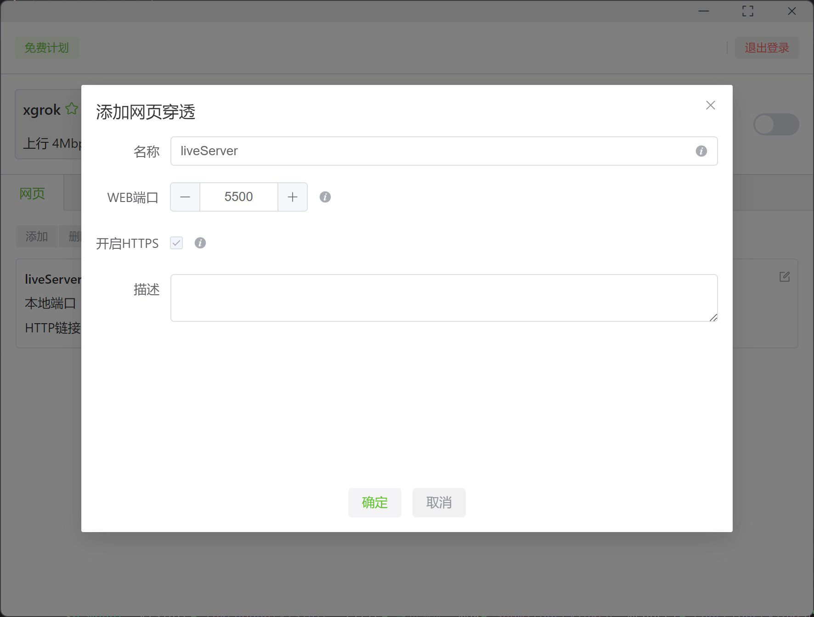

# 您的应用代理访问工具

软件可以通过该网址进行下载 [https://www.xdo.icu](https://www.xdo.icu)

本软件是一个网络穿透代理软件，可以实现局域网内服务穿透至公网，在公网上自由访问。软件本身是基于ngrok进行的二次开发，旨在利用图形化界面方便隧道的管理和配置。

本软件和ngrok还是有点区别的，例如

* 自带ssl，可以使用https协议
* 可切换不同的服务器
* 自定义专属域名
* 速度稳定
* 图形化配置，简单方便
* 后台持久运行，带心跳检查

后续支持的功能
- [ ] 代理同一局域网内服务
- [ ] 提供mac和linux版本
- [ ] 上线高速服务器

本软件所使用的服务器都是本人在云服务商购买的，默认可以免费使用一个4M上行带宽的服务器。如果你觉得好用，可以购买付费计划，提供相对稳定高速的服务。

## 主界面

## 配置隧道

## 服务器选择

## 订阅界面

