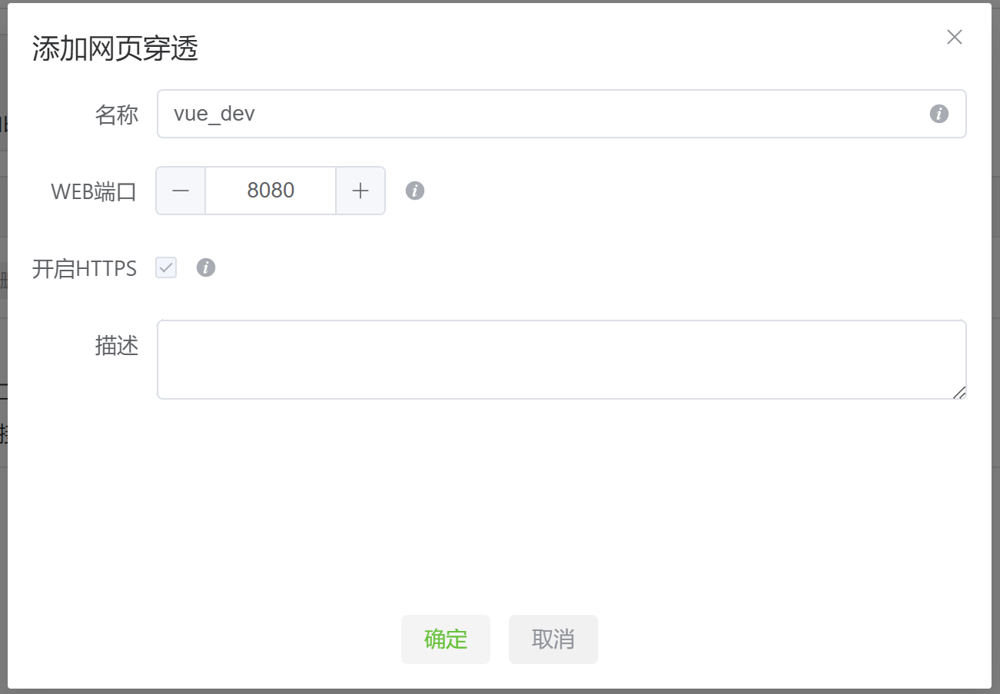
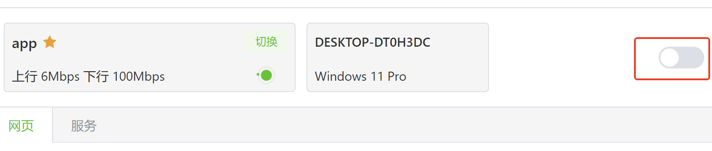
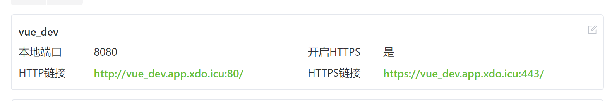

# 使用xgrok进行vue开发的代理配置

> 如果你是一个前端开发人员，在进行移动端开发时，有时需要在真机上预览效果，而公司又没有提供内网wifi，这时候可能开发就会卡在此处，让人头疼。

本教程就是告诉你，如何通过xgrok代理本地的vue开发服务，并在移动终端上查看效果。

## 步骤
1. 修改vue.config.js配置

禁用host检查
```javascript
// vue_cli v4
module.exports = {
    devServer: {
        disableHostCheck: true,
        host:'0.0.0.0'
    }
}
// vue_cli v5 
module.exports = {
    devServer: {
        allowedHosts: 'all',
        host:'0.0.0.0'
    }
}
```

2. 在xgrok中添加网页穿透



名称：填写任意未被占用的名称

WEB端口：填写vue默认开发端口8080

3. 启动穿透



4. 手机访问代理出来的地址



