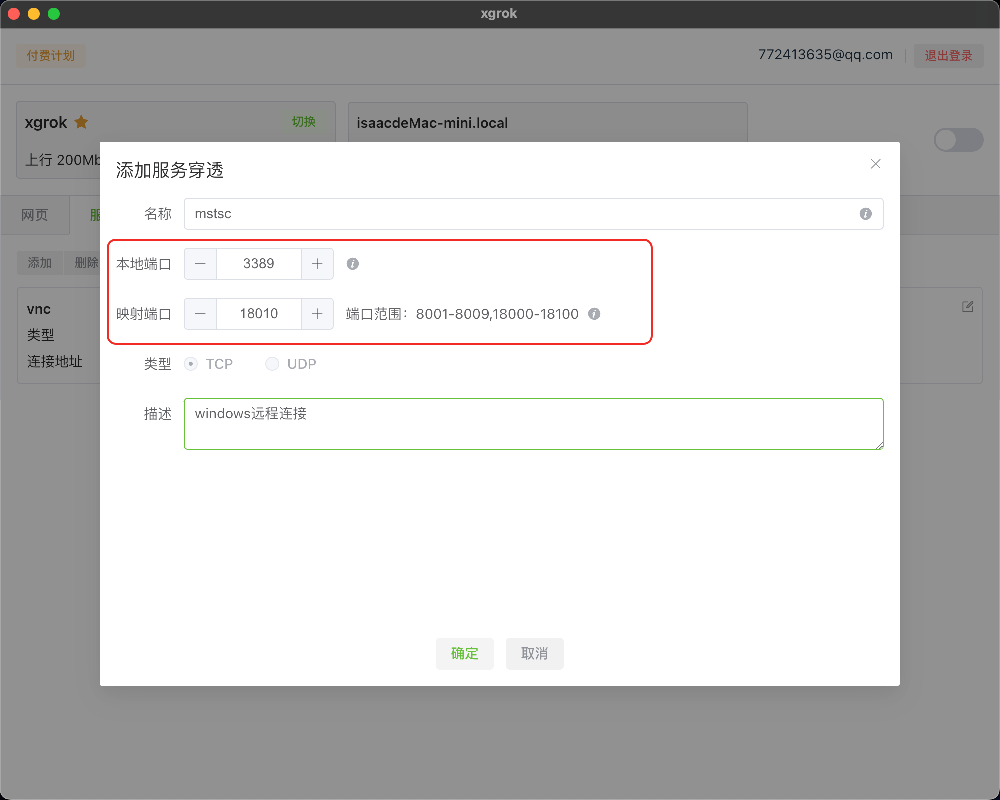

# 使用xgrok进行远程连接的配置
> 远程连接在工作中是一个非常刚需的需求，你可以通过远程公司电脑进行远程办公或者处理一些紧急事项

常用的办公系统要么是Windows，要么就是MAC，这两个系统xgrok都能进行远程设置。首先我们以Windows系统为例，介绍如何使用xgrok配置远程连接。

## 步骤
1. 打开xgrok软件，在主界面选择“服务”

2. 添加一个新的服务映射配置

3. 开启映射

4. 配置Windows远程服务，打开“系统-远程桌面”，开启远程桌面

5. 如果Windows开启了防火墙，还需要在防火墙中配置允许远程连接，进入“控制面板-Windows Defender防火墙”，点击“允许应用或功能通过WindowsDefender防火墙”。进入防火墙界面，点击右上角的“更改设置”，找到“远程桌面”这一项，对其右边的三个选项都打勾，分别是“域，专用，公用”，最后点击确定。

6. 进行远程连接，如果你是Windows系统，则推荐使用系统自带的远程连接工具，按住“windows+R”键，输入“mstsc”回车，出现如下的界面：

在“计算机”这一栏中输入刚才配置的映射地址(域名+端口号)。比如“xgrok.xdo.icu:18010”，地址可以从刚才的配置界面拿到。

7. 最后进行远程，如果提示需要用户名密码，则输入被远程机子的用户名密码即可（用户必须要有密码，没有密码无法远程）。

8. 如果你是MAC电脑，想远程Windows的话，推荐Jump Desktop。配置和windows同理，配置正确的地址，用户名密码即可远程。

